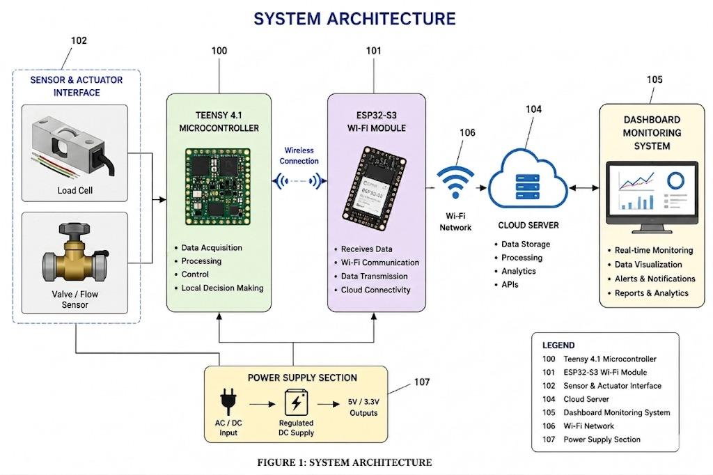
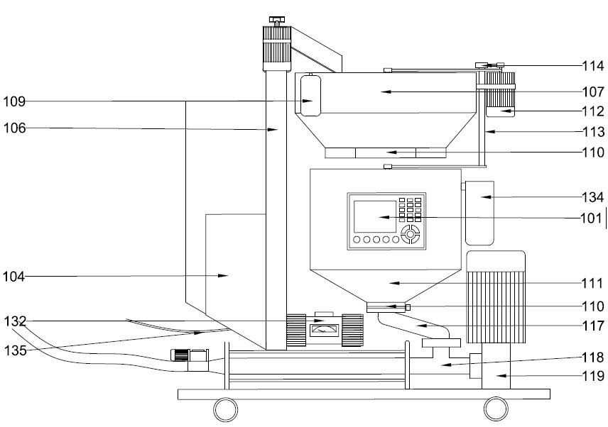

# Smart IoT-Enabled Automated WeighBatching System for Plastering Using Teensy 4.1 and Load-Cell

## Overview

This project is an Industrial IoT-based Automated Weigh Batching System developed for plastering applications using Teensy 4.1 and ESP32.

The system performs accurate cement, sand, and water batching using industrial load cells and ADS1232 24-bit precision ADC with real-time monitoring dashboard and automated material control.

The project is designed to improve batching accuracy, reduce manual errors, minimize material wastage, and provide reliable automated plaster material preparation for smart construction environments.

---

## Objective

To develop a smart IoT-enabled automated weigh batching system for plastering applications using Teensy 4.1 and ESP32 with accurate material dispensing, automated relay control, and real-time monitoring dashboard.

---

## Features

- Automated cement, sand, and water batching
- Real-time weight monitoring
- ESP32 WiFi-based dashboard
- Remote START/STOP control
- Emergency safety system
- ADS1232 high precision ADC interfacing
- Automated relay and valve control
- Live batching stage monitoring
- UART communication between Teensy and ESP32
- Industrial automation logic implementation
- Real-time system status monitoring
- IoT-enabled dashboard communication

---

## Hardware Used

- Teensy 4.1
- ESP32
- ADS1232 24-Bit ADC
- Industrial Load Cells
- Water Flow Sensor
- Relay Module
- Solenoid Valve
- LCD Display
- Buzzer
- Hopper Motor
- Power Supply Unit

---

## Technologies Used

- Embedded C/C++
- Arduino IDE
- UART Communication
- ESP32 WiFi Communication
- IoT Dashboard Monitoring
- Industrial Automation
- ADS1232 Precision ADC
- Load Cell Calibration
- Real-Time Monitoring System

---

## System Architecture



---

## Interfacing Diagram


---

## System Design



---

## Working Principle

1. System initializes all sensors, relays, and communication modules.
2. Load cells continuously measure material weight.
3. Teensy 4.1 processes load-cell data using ADS1232 precision ADC.
4. Relay modules automatically control sand, cement, and water dispensing.
5. ESP32 sends real-time batching data through WiFi.
6. Dashboard displays live system stage, weight, and relay status.
7. Automated batching process completes after all stages finish successfully.
8. Emergency stop system immediately shuts down all operations during fault conditions.

---

## Pin Connections

| Component | Teensy 4.1 Pin |
|---|---|
| ADS1232 DOUT | 8 |
| ADS1232 SCLK | 9 |
| ADS1232 PDWN | 10 |
| Start Button | 2 |
| Emergency Stop | 3 |
| Sand Relay | 29 |
| Cement Relay | 30 |
| Water Pump | 27 |
| Hopper Motor | 4 |
| Buzzer | 18 |

---

## Project Structure

```bash
Smart-IoT-Weigh-Batching-System/
│
├── Codes/
├── Documentation/
├── Research_Paper/
├── Certificates/
├── Simulation/
├── Dashboard_Results/
├── Images/
├── README.md
├── LICENSE
└── .gitignore
